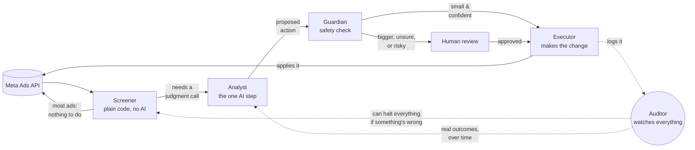

# ARCHITECTURE.md — Task B: Designing the Agent Army

This is a POC architecture for an agent system that replaces the bulk of media buyer
decision-making across the six accounts in scope. It is written to be read start to finish —
each section states what it decided, why, and which piece of `INVESTIGATION.md` evidence or
external pattern justifies it. Nothing here is proposed from a blank slate; every threshold and
every role traces back to something Task A actually found in the data.

**The mandate, restated because it governs every decision below:** maintain or grow total spend
and absolute profit while improving efficiency. A design that optimizes ROI by shrinking the
account fails the assignment even if every individual decision looks locally correct.

**External research consulted** (see the note at the end of this document for the full list):
Anthropic's own agent-design patterns (routing, prompt chaining, evaluator-optimizer),
2026 ad-tech guidance on agentic media buying, and the current kill-switch/circuit-breaker
distinction used in production agent systems. None of it changed the fundamental shape of this
design — it validated the direction already in progress and added two concrete refinements
(a phased-autonomy rollout, and a cleaner kill-switch/circuit-breaker split), both incorporated
below and flagged where they appear.

---

## 1. Agent topology

### Why multiple components, not one agent

A single agent that reads data, judges, and executes in one LLM call has three specific problems,
each traceable to something in `INVESTIGATION.md`:

- **Cost.** Most adsets, most cycles, need no decision at all. If every adset gets a real LLM
  call, the $30/day budget is spent on judgment nobody needed (see §3 — the actual math shows
  this isn't the binding constraint it looks like, but only *because* most volume is filtered
  before it reaches a model).
- **Blast radius.** If the same call that judges also executes, a bad output becomes a bad action
  with nothing in between to catch it. R02's no-cooldown compounding-cuts pattern (§1 of
  `INVESTIGATION.md` — one adset hit repeatedly with no gap between actions) is what happens when
  nothing checks a decision against bounds before it fires.
- **Nobody watches the portfolio.** The brief's central warning — "an agent that pauses
  everything would score a great ROI and destroy the business" — is a portfolio-level failure
  invisible to any component only looking at one adset at a time.

This maps onto Anthropic's own **routing** pattern (a cheap classifier decides whether the
expensive path is even needed) composed with **prompt chaining** (judge → check → act, each step
consuming the previous step's output) rather than a single **orchestrator-worker** call — routing
fits better here because the "next step" isn't an open-ended, dynamically-decided task
breakdown, it's a fixed, known pipeline. The brief's own example split — "monitor, analyst,
executor, auditor" — is exactly this shape; the design below takes that and adds one role the
mandate specifically requires.

### The five roles

| Role | LLM? | What it sees | What it can do | Why it exists |
|---|---|---|---|---|
| **Screener** (Monitor) | No — SQL/code only | Today's spend/budget for active adsets, current live budget, recent action history per adset (for cooldown checks) | Route an adset to "no action" or "flag for Analyst review," with a reason code | High-volume, cheap filter — the main lever for the cost budget. Never sees or needs revenue/ROI before it's reliable (§1.4 of `INVESTIGATION.md`) |
| **Analyst** (the Adset Decision Agent Task C builds) | Yes | A compressed, structured brief per flagged adset — exact contents in §5 | Propose one of `scale_up / scale_down / pause / keep / escalate`, picking a budget step from a pre-computed, bounded set (never a free-form number — see §2), plus confidence and reasoning | The actual judgment layer — the only role that needs real reasoning over ambiguous evidence |
| **Portfolio Guardian** *(added beyond the brief's example list)* | No — deterministic checks; can call a cheap model only for the daily aggregate summary a human reads | Proposed decisions for the current cycle + account/portfolio-level rollups (today's total spend/profit vs. trailing average, count of pauses already taken today) | Approve, clip, or force-escalate a proposed decision against concrete bounds (§2) | Nothing else in the pipeline can see the aggregate. This is the component that exists specifically because of the mandate — without it, a system of individually-reasonable Analyst decisions can still collectively shrink the account |
| **Executor** | No — deterministic | Only the approved decision object, plus the *live* budget re-fetched from Meta immediately before acting (never a cached value) | Call the Meta API; log the raw response | Re-fetching live budget directly addresses the `old_budget` vs. `current_budget_from_fb` drift found in Task A (issue #7) — the Executor never acts on a stale number |
| **Auditor** | No for per-decision reconciliation; cheap model for periodic anomaly summarization only | The decision ledger, Meta's actual post-action state, and settled performance once it arrives (days later) | Flag reconciliation mismatches (told Meta X, Meta shows Y); write the settled-outcome label back to the ledger | Directly motivated by R09: a rule tried 8 times to fix a mistake and every attempt silently failed for 61 hours with nothing watching. This role is the thing that didn't exist and should have |

Only **one** of these five is a per-decision LLM call. That's not incidental — it's the same
design decision that answers §3's economics question, seen from a different angle.

### Diagram — pipeline and role boundaries

![Simplified agent pipeline: Meta feeds the Screener, which quietly handles most adsets itself and sends only the ones that need judgment to the Analyst, the one AI step. The Analyst's proposed action passes through the Guardian's safety check, which either sends it straight to the Executor or holds it for a human to approve first. The Executor applies approved changes back to Meta and logs everything to the Auditor, which can halt the whole pipeline if something looks broken and feeds real outcomes back to the Analyst over time.](supporting/assets/agent-pipeline-diagram.png)

**In plain terms**: an ad's day starts at the **Screener** — plain code, no AI, just checking
numbers against thresholds. Most ads need nothing done, so most of them stop right there. Only
the ones that actually need a judgment call (a new ad, one trending up or down, one pacing
oddly) go to the **Analyst** — the one step that's actually AI. Whatever the Analyst proposes
goes through the **Guardian**, a safety check with hard, non-negotiable limits: if the proposal
is small and the Analyst is confident, it goes straight to the **Executor** to make the real
change on Meta; if it's a bigger change, the Analyst wasn't sure, or something about the ad looks
off, a **human** reviews it first. Every action — automatic or human-approved — gets logged to
the **Auditor**, which does two jobs: it double-checks the change actually took effect on Meta
(this is the exact check that would have caught the R09 failure from `INVESTIGATION.md` within
minutes instead of 61 hours), and once revenue settles days later, it feeds the real outcome back
so the Analyst's future judgment gets sharper. If the Auditor ever spots something seriously
wrong, it can halt the whole pipeline — see §4 below for exactly how that works and how it differs
from a human hitting a manual stop button.

*Static render above for portability (any Markdown viewer); the Mermaid source below is the
editable version.*



---

## 2. Decision boundaries

Concrete numbers, each traced to a specific piece of evidence — not "reasonable limits."

| Tier | Condition | Example |
|---|---|---|
| **Autonomous** | Within all bounds below, confidence ≥ 0.7, no active data-quality flag on the adset or account | Budget change ≤ 20% in either direction; `keep`; `pause` on an adset with ≥ 3 settled days and clearly negative trailing ROI |
| **Requires human approval** | Budget change 20–50%, OR confidence 0.4–0.7, OR adset has < 2 settled days of history, OR account-level daily pause count is already elevated | The buyer's real "scaling +200%" case from our design discussion — a >50% jump on 1 day of data would never clear autonomous bounds |
| **Forbidden** | Budget change > 50% in a single action, any action on an adset flagged with an unreconciled prior failure (Auditor hasn't confirmed the last action actually took effect), any action while that account's circuit breaker is tripped | — |

**Specific thresholds and the evidence behind each:**

- **Max single-action budget change: 20% autonomous / 50% hard ceiling.** The historical rules
  in this data cap decreases at −40% and buyer notes describe swings up to +100–200% off a single
  day of data — both of which produced documented bad outcomes (§2 of `INVESTIGATION.md`, and the
  `730115451617748648` buyer case from our design discussion). 20% is deliberately tighter than
  what the current system allows.
- **Cooldown: minimum 4 hours between automated actions on the same adset.** Directly targets
  R02's no-cooldown compounding-cut pattern — the current rule engine can act on the same adset
  every 30 minutes with nothing preventing repeated cuts before the previous one has had time to
  show an effect.
- **Minimum data floor: no autonomous `scale_up`/`scale_down`/`pause` on an adset with < 2 settled
  days of history or < $5 total settled spend.** Below the floor, the only autonomous output is
  `keep` or `escalate`. This is the direct fix for the thin-data overconfidence failure mode —
  both R04's day-1 kills and the buyer's "3 days" case are exactly this situation.
- **Confidence must be capped by data volume, not asserted.** An adset below the minimum data
  floor cannot receive confidence > 0.5 regardless of what the model outputs — enforced by the
  Guardian, not requested of the model. (Full mechanism in `RESULTS.md`, Task C.)
- **Portfolio-level floor: if today's approved pause/decrease actions would reduce projected daily
  total spend by more than 10% versus the trailing 7-day average for that account, the *marginal*
  action beyond that point is force-escalated, not auto-approved.** This is the concrete
  implementation of the mandate — the one guardrail with no direct precedent in the current rule
  system, because the current system has no portfolio-level awareness at all.

### How "amount" actually gets decided — not a free-form number

The historical rule set never used arbitrary dollar figures — every rule is a fixed percentage
step (R02: −20%, R07/R12: −40%, R10: −15%). This design keeps that pattern rather than asking the
model to invent a number, and improves on it: **the system pre-computes a small set of candidate
budget-change steps before the Analyst runs** — `{-20%, -10%, 0% (keep), +10%, +20%}` of the
adset's current budget, generated from the same ±20% autonomous ceiling defined above. The
Analyst picks from that set; it cannot output a step the set doesn't contain. If the situation
genuinely calls for something larger, the only available output is `escalate` — a human decides
the bespoke amount, the model never gets to reach past the pre-vetted range on its own.

This is a structural constraint, not a post-hoc check: an LLM asked for a raw dollar figure can
occasionally produce something wildly wrong in the number itself (a hallucinated magnitude); an
LLM restricted to five pre-vetted options cannot produce an out-of-bounds one by construction.

### Where the hard limits actually live — three layers, not one

The limits above are enforced independently at three points, deliberately redundant (a standard
"defense in depth" pattern — if one layer has a bug, the others still catch it):

| Layer | Enforces | Catches what the others can't |
|---|---|---|
| **Option generation** (before the Analyst runs) | Candidate steps are pre-derived from the ±20%/±50% ceiling — the model structurally cannot propose outside it | Bad output before it's even a decision |
| **Portfolio Guardian** (after the Analyst, before execution) | Per-action bounds, cooldown, and the account-level aggregate mandate check | The aggregate check specifically — that's account-wide state no per-adset option generator can see |
| **Executor** (immediately before the write) | Re-fetches the *live* budget from Meta and re-derives the real dollar delta against current reality | Staleness — the decision may be several minutes old by the time it executes |

### The decision logic, explicitly

```
GIVEN a flagged adset with: proposed_action, proposed_step, confidence, data_quality_flags

IF "unreconciled_prior_action" in data_quality_flags:
    -> FORBIDDEN -- route to Auditor, do not execute

ELIF account.circuit_breaker_tripped:
    -> FORBIDDEN -- queue for human, log

ELIF adset.settled_days < 2 OR adset.total_settled_spend < $5:
    -> force action = "escalate", regardless of what the Analyst proposed (the data floor)

ELIF abs(proposed_step) > 20%:
    -> requires_human_approval   (only reachable via escalate anyway -- option generation caps at 20%)

ELIF confidence < 0.7:
    -> requires_human_approval

ELIF hours_since_last_action(adset) < 4:
    -> requires_human_approval   (cooldown not yet expired)

ELIF portfolio.todays_approved_spend_reduction(account) > 10% of trailing_7d_avg:
    -> requires_human_approval   (aggregate mandate check -- this marginal action specifically)

ELSE:
    -> AUTONOMOUS -- proceed to Executor
```

### Phased autonomy rollout *(refinement from external research, not in the original design)*

Current best practice in agentic ad-buying (see sources) is to earn autonomy incrementally rather
than grant it on day one — "narrow, reversible pilots in recommend-only mode, widening as audit
trails earn trust." Applied here:

1. **Phase 1 — shadow/recommend-only.** The full pipeline runs, the Analyst and Guardian produce
   real decisions, but the Executor never calls Meta — everything queues for human approval
   regardless of tier. Purpose: build the Auditor's outcome ledger against real decisions before
   any of them touch real budgets.
2. **Phase 2 — bounded autonomy.** Once Phase 1's ledger shows the Analyst's `keep`/high-confidence
   decisions are reliable (a concrete bar — e.g. 2+ weeks, agreement with what a human would have
   done on a sampled audit), the autonomous tier above goes live, but only for actions ≤ 10% (half
   the eventual 20% ceiling).
3. **Phase 3 — full autonomous tier.** Ceiling widens to the full 20%/50% bounds above once
   Phase 2 accumulates its own track record.

This doesn't change anything else in this document — the bounds in the table above are the
Phase 3 end-state; Phases 1–2 are the same pipeline with tighter numbers.

---

## 3. The economics

### The math

**Scale.** Active adsets/day across the six accounts in this dataset trended 300 → 751 over the
week (`perf` joined to `meta.effective_status='ACTIVE'`, re-verified directly for this document).
Using **750/day** as the current working scale.

**Screener (Tier 1): $0.** Pure SQL against cached/lightly-refreshed fields. Every one of the 750
adsets gets screened every cycle at no LLM cost.

**Analyst (Tier 2) — the exact Screener rule, and what it actually measures at.**

The Screener flags an adset for Analyst review if **any** of:
1. It is on its first settled day (`spend_day_no = 1`) — the exact situation behind R04's 109
   day-1 kills and the buyer's "3 days" mistake; reviewed once, not re-flagged on day 2/3 purely
   for being young (avoids redundant review of an unchanged thin-data situation)
2. Trailing 3-day ROI ≤ −30% (approaching the danger zone R02/R04 operated in)
3. Trailing 3-day ROI ≥ +30% for the window (a genuine scale-up candidate — the mandate requires
   this be symmetric with the cut-side condition above, not just a loss-catching filter)
4. Spend has reached ≥70% of the daily budget unusually early (pacing check)

Measured against the last 3 days of real data, using a proper trailing-3-day window rather than
the point-in-time figures `rule_exec` only captures at actual firing moments: **42–66% of active
adsets, climbing over the week** (606→751 active adsets, 257→496 flagged) — not 20%. The
dominant driver is condition 1: this account is in a visible growth phase within the dataset
(active adsets roughly doubled over the week), so "review the new adsets" is not an edge case
here, it's often the majority of daily volume. That's a real, data-grounded property of this
account, not a flaw in the rule — but it does mean the original 20% assumption materially
understated real volume, and the number below is corrected to the measured rate (66%, the most
recent and most representative day) rather than the original guess.

**One condition doesn't actually work yet, and that's reported here rather than hidden:**
condition 4 (pacing) fired **zero times across all three test days.** The cause is Data Issue #6
from `INVESTIGATION.md` — `meta.daily_budget` is on an inconsistent, unresolved scale relative to
real spend (the same ~100–300× mismatch documented there), so comparing today's `spend` against
it produces a threshold that's essentially never reachable. This is a genuine open item for this
design: the pacing check needs to be rebuilt against a budget figure on the same scale as actual
spend (most likely the live value read directly from Meta, not `meta.daily_budget`) before it can
do anything — noted here rather than left silently broken.

751 active adsets × 66% ≈ **496 Analyst decisions/day** (using 2026-06-12, the most recent and
most representative day in the dataset).

**Tokens per decision** (full detail and a worked example of the actual compressed context is in
§5):
- Per-adset context: ~500 input tokens (trailing daily series, budget history, recent actions,
  cohort percentile, data-quality flags — structured, not raw table rows)
- System prompt (policy, schema, thresholds, mandate, calibration rules): ~800 tokens, **cached**
  after the first call in a batch — cache hits cost 10% of standard input price
- Output (the decision JSON + reasoning): ~250 tokens

**Model choice and cost** (current pricing, per million tokens — Haiku 4.5 $1/$5, Sonnet 5 $2/$10):

- **Haiku 4.5 for the default Analyst call** (~85% of the 496, ≈422 calls/day). This is a
  bounded, schema-constrained classification-with-reasoning task over well-structured context —
  squarely within a smaller model's competence, and that's not just asserted here: Haiku 4.5
  scores within ~5 points of Sonnet 4.5 on SWE-bench Verified (73.3% vs. 77.2%) at roughly a
  third of the cost, supports native structured/JSON output (what this schema needs), and is the
  first Haiku generation with extended thinking available — it is not a purely shallow model, it
  can reason step-by-step when the task calls for it. The escalation path exists precisely because
  some flagged adsets *do* call for that; most don't.
  422 calls × (500 + 80 cached-system-prompt-equivalent) input ≈ 244,760 input tokens/day;
  422 × 250 output ≈ 105,500 output tokens/day.
  Cost: (244,760/1e6 × $1) + (105,500/1e6 × $5) ≈ **$0.77/day**.
- **Sonnet 5 for escalated cases** (~15% of the 496, ≈74 calls/day — genuinely ambiguous cases,
  or any case the Analyst's own confidence check flags below 0.5). Slightly larger context budget
  for a second pass: ~1,000 input + 400 output.
  74 × 1,000 = 74,000 input; 74 × 400 = 29,600 output.
  Cost: (74,000/1e6 × $2) + (29,600/1e6 × $10) ≈ **$0.45/day**.
- **Portfolio Guardian's daily digest** (one cheap-model call/day summarizing the day's aggregate
  picture for a human, not per-decision): negligible, well under $0.05/day.

**Total: roughly $1.22/day**, against a **$30/day budget** — about **25× headroom** at this
data's actual, measured scale (not the 70× a first, unverified estimate implied).

**A separate rate limit worth naming explicitly: Anthropic's own API limits, not Meta's.**
Everything about rate limits earlier in this document is about *Meta's* API — this is the other
one. Even Anthropic's lowest published tier allows 1,000 requests/minute and 2,000,000 input
tokens/minute; this design's entire daily volume (496 calls) is a rounding error against a
*per-minute* limit, so nothing about this design needs to be paced around it. One more relevant
fact: as of a June 2026 policy change, Anthropic **equalized rate limits across Haiku, Sonnet, and
Opus at every tier** — they used to differ by model, they no longer do. That means the Haiku
default chosen above is a pure cost/latency/task-fit decision; it buys no rate-limit headroom
advantage over Sonnet that Sonnet doesn't also have.

### What this means — the honest reading, not just the number

The $30/day ceiling is **not the binding constraint** at this workload. That's a real finding,
not a hedge: it means the constraint is functioning as a *governance* bound (a hard ceiling that
catches a runaway loop or a misconfigured batch), not a *design* pressure that should shape which
model gets used where. Restating that as design guidance:

- **Cheap model (Haiku 4.5) is the default**, not a cost-driven compromise — it's simply
  sufficient for the task shape, and the headroom means there's no pressure to downgrade further.
- **Expensive model (Sonnet 5) is for escalation and ambiguity specifically**, not for "important"
  adsets by spend size — the trigger is uncertainty, not dollars, because the cases that went
  wrong in Task A (thin data, delayed revenue) are exactly the low-confidence cases, not
  necessarily the highest-spend ones.
- **Opus-tier reasoning has no per-decision role here.** The only place a top-tier model could
  earn its cost is a low-frequency, high-leverage task — e.g. a weekly portfolio-strategy review
  synthesizing the week's Auditor outcomes — not the per-adset loop. Not included in the cost
  above because it isn't part of the per-cycle pipeline.
- **No model at all, by design, for**: the Screener (pure SQL), the Guardian's bounds checks
  (deterministic thresholds), and the Executor (deterministic API calls). These aren't "cheap
  LLM calls" — they're not LLM calls, and that's deliberate: a threshold check or an API call
  doesn't benefit from being probabilistic.

**At what account scale does this beat a media buyer's salary?** Working from a stated assumption
(a marketer costs **$5,000/month**, ÷21 working days ≈ **$238/day**) rather than leaving this
unquantified: against the measured $1.22/day system cost, that's a **195× multiplier** — LLM cost
alone wouldn't reach one buyer's daily cost until the system ran roughly **1,171 accounts** at
this data's current adset-density (~125 active adsets/account). That's a concrete number, and it
confirms rather than dodges the earlier framing: **LLM API cost is not the gating factor for
whether this replaces a buyer**, at any account count a real deployment would plausibly reach.
The real question for an actual 6-account deployment isn't a cost crossover — it's whether
automating these specific decisions frees up enough of that person's time to matter, which
depends on what fraction of a buyer's day goes to exactly this kind of decision versus creative
work, client communication, and reporting — not something this dataset can answer, so left as an
open assumption rather than forced into a number.

### What we'd do with the unused budget — not every option is worth it

At 25–195× headroom, the constraint on improving this system stops being cost and starts being
*task fit* — spending more only helps where there's real judgment to improve, not everywhere.

- **Upgrading every Analyst call from Haiku to Sonnet 5** (~$2.98/day, still 10× headroom left)
  buys a small, roughly uniform quality bump across every decision — including the majority that
  are already easy. Simple, but shallow.
- **Adding a second, independent evaluator pass on every Analyst decision before it reaches the
  Guardian** (~$0.56/day more, ~$1.78/day total, 17× headroom left) is the stronger use of slack
  budget, and a real gap in the design as it stood: §1 cites Anthropic's routing, prompt-chaining,
  *and* evaluator-optimizer patterns, but only the first two were actually used anywhere.

  **What the evaluator checks — not the same failure modes already handled elsewhere.** The
  thin-data case is already structurally unreachable — the minimum data floor above forces
  `escalate` before the Analyst's confidence even matters. R08's age-only-judgment problem was a
  symptom of the *old rule engine* having no performance condition at all; the Analyst is never
  in that position, since it's always handed real performance data (§5). The evaluator's actual
  value is two things neither the Guardian nor the data floor can catch, because both only ever
  check the *output*, never the *reasoning* or the *absence* of an action:
  1. **Hallucination / context-fidelity** — does the Analyst's stated reasoning actually match the
     data it was given (e.g. a claimed trend that isn't in the context object)? Nothing else
     checks the model's output against its own input.
  2. **Missed growth, not just excess shrinkage** — the Guardian's aggregate check only watches
     cumulative spend *reduction* crossing 10%; it has no mechanism for an adset with clearly
     positive signals that the Analyst timidly calls `keep` instead of `scale_up`. That's always
     within bounds (nothing looks safer than doing nothing), so it never trips any guardrail, and
     a system that's quietly too conservative across many adsets fails the "grow" half of the
     mandate as surely as one that shrinks too aggressively.

**Where an LLM is still not the answer, regardless of budget** — this is the part that matters
more than which upgrade to buy: the **Screener** should never become LLM-backed at any budget,
because its checks are exact numeric comparisons with no ambiguity to reason about; the same
holds for the **Executor**, whose job is a mechanical API call. Headroom removes the cost
objection to adding more model calls — it does not remove the task-fit objection, and the
Screener is the clearest example of a role where that objection is the real one. The **Portfolio
Guardian's hard bounds checks** stay deterministic for a related reason: a safety cap that's
allowed to be probabilistic isn't really a hard cap. Where the Guardian *could* legitimately use
the evaluator-style judgment above is a narrower case: when several pause/decrease candidates
compete for the same daily portfolio spend-reduction headroom, deciding *which specific ones* get
autonomously approved is a real prioritization trade-off, not a threshold check.

---

## 4. Failure modes

Five ways this system loses money or breaks, each with a guardrail, ranked by how directly each
is evidenced in `INVESTIGATION.md` rather than hypothesized:

| # | Failure mode | Evidence | Guardrail |
|---|---|---|---|
| 1 | **Silent execution failure** — the system believes an action succeeded (or is trying to fix a mistake) while the API call is actually failing, and nothing notices | R09: 8 consecutive attempts to reactivate a mistakenly-killed adset, 100% failure rate, 61 hours undetected | Auditor reconciles every decision against Meta's actual state, not just the API response code; circuit breaker trips on N consecutive failures **per account** (not per adset — the outage was account-scoped) and freezes all automated action on that account |
| 2 | **Portfolio-level "shrink to a good ROI" failure** — individually-reasonable pause/decrease decisions collectively shrink the account, which is the core risk the mandate exists to prevent | The mandate itself; no direct rule-engine precedent because the current system has no portfolio awareness to fail this way, which is itself the gap | Portfolio Guardian's aggregate spend-floor check (§2) — the marginal action beyond a threshold is escalated, not auto-approved |
| 3 | **Thin-data overconfidence** — a decision made confidently on data too new or too small to support it | R04's 109 day-1 kills; the buyer's "3 straight green days" claim on a 1-day-old adset | Minimum data floor forces `keep`/`escalate` below a spend/history threshold (§2); confidence is capped by data volume, not self-reported by the model |
| 4 | **Compounding/whipsaw actions** — repeated actions on the same adset before the previous one has had time to show an effect | R02's no-cooldown pattern; the buyer scaling up 100%+ then cutting back the next morning | 4-hour minimum cooldown per adset, enforced by the Guardian, independent of what any individual decision recommends |
| 5 | **Acting on stale state** — a decision executes against a budget value that no longer matches reality | `old_budget` vs. `current_budget_from_fb` drift (64/214 rows disagreed); "Decrease" rules occasionally logging an increase | Executor re-fetches the live budget immediately before acting and aborts (flags for review, doesn't guess) if it disagrees with the value the decision was based on beyond a small tolerance |

### Kill switch vs. circuit breaker — deliberately two different mechanisms

Following the current standard distinction (see sources): a **kill switch** is manual — a human
sees something wrong and stops the system; a **circuit breaker** is automatic — it trips on
defined conditions before a human notices anything. Conflating the two into one "emergency stop"
button is a common design mistake this document deliberately avoids.

- **Circuit breaker (automatic, scoped).** Trips independently at three scopes:
  - *Per-account*: N (e.g. 3) consecutive API failures on that account → freeze all automated
    action on that account, alert.
  - *Per-adset*: the Auditor detects a reconciliation mismatch on that adset → freeze that adset
    specifically, don't assume the whole account is affected.
  - *Portfolio-wide*: aggregate spend or profit drops beyond a defined intraday threshold across
    the six accounts → freeze all automated `pause`/`scale_down` actions everywhere (not
    `scale_up` — a portfolio-wide problem shouldn't block plausible recovery actions).
  - **Fails safe**: when a breaker trips, the affected scope drops into a defined no-action
    state — existing budgets stay exactly where they are, nothing new gets automated, everything
    routes to the human queue. It does not attempt to auto-correct or roll back; a second layer
    of automated action in response to a detected failure is its own risk.
- **Kill switch (manual, layered).** A human can stop the system at adset, account, or global
  scope at any time, independent of whether a breaker has tripped. Layered per current practice:
  session/cycle termination (stop the next scheduled run) → permission revocation (Executor's
  write credentials disabled) → full deactivation (nothing runs until manually cleared). Not a
  single button — each layer is independently triggerable depending on how urgent the situation
  is.

---

## 5. Data flow

### What's pulled every cycle vs. cached vs. queried on demand

| Data | Frequency | Why |
|---|---|---|
| Live budget per adset (from Meta) | Fresh, every cycle for flagged adsets; always fresh immediately before the Executor acts | Directly addresses the stale-budget drift found in Task A — never trust a cached budget for an actual write |
| Today's spend | Fresh, every 30-min cycle, for all active adsets | Spend lags revenue much less (§1.4 — median 92.4% of final spend visible at action time), so it's cheap and reliable to poll often |
| Today's revenue/ROI | Fresh, but **flagged as provisional before ~09:00 local** and excluded from autonomous decisions until later in the day | The revenue-delay characterization is the single most load-bearing number from Task A — same-day ROI understates the final figure by the most in exactly the hours the system would otherwise be most tempted to act on it |
| Campaign/adset metadata (status, targeting, naming) | Cached, refreshed on a slower cycle (e.g. hourly) | Changes rarely; polling it every 30 min wastes rate-limit budget on data that's almost always unchanged |
| Trailing daily performance series (last ~7 days) | Cached, refreshed once/day after that day settles | This is what feeds the Analyst's context — doesn't need to be live, needs to be *settled* |
| `buyer_actions.csv` history for a specific adset | Queried on demand, only when that adset is flagged for the Analyst | See risk discussion below — this is informational context, not a training signal |
| Decision ledger (this system's own past decisions + outcomes) | Queried on demand by the Analyst (recent precedent) and continuously written by the Executor/Auditor | This is the feedback-loop substrate — see `RESULTS.md` (Task C) for how it's used |

### How raw tables become decision-ready context — and the exact context per agent

**Screener** reads only cheap, narrow fields per cycle: `adset_id`, today's `spend`, live budget,
`effective_status`, and a lookup against the decision ledger for "last automated action timestamp
on this adset" (for cooldown enforcement). It does **not** read revenue, ROI, or historical
trends — that's deliberately the Analyst's job, so the Screener stays cheap and fast at high
volume.

**Analyst** receives a single structured object per flagged adset — not a table, not raw CSV
rows. Concretely, per decision:

```
{
  "adset_id": "...",
  "account": "ACC-04",
  "vertical": "easy-hearing-aids-program"  // parsed from the naming convention
  "age_days": 1,
  "current_budget": 1.27,
  "trailing_daily": [
    {"date": "2026-06-10", "spend": 0.00, "roi": null, "note": "pre-launch, partial day"},
    {"date": "2026-06-11", "spend": 2.93, "roi": 0.23, "settled": true}
  ],  // up to 7 days, compact — this is the entire history, not a sample
  "today_partial": {"as_of": "14:30", "spend_so_far": 1.10, "roi_so_far": -0.15,
                     "data_quality": "provisional -- within known revenue-delay window"},
  "recent_actions": [
    {"source": "buyer", "time": "...", "change": "2.54 -> 5.08", "note": "scaling +200%..."}
  ],  // last N actions on THIS adset only, from both rule_exec and buyer_actions
  "cohort_percentile_roi": 62,  // this adset's trailing ROI vs. similar adsets, same vertical
  "data_quality_flags": ["insufficient_history"],  // pre-computed upstream, not for the model to guess
  "mandate_reminder": "grow total spend and profit; do not optimize ROI by shrinking"
}
```

This is deliberately small — a few hundred tokens, not a table dump — and every field is
pre-aggregated by deterministic code before the model ever sees it. The model is never handed
`daily_adset_performance.csv` and asked to find the trend itself.

**Portfolio Guardian** receives only the proposed decision object plus a small aggregate query
result (today's account-level spend/profit vs. trailing average, count of pauses already
approved today) — not per-adset detail beyond what's needed to check the specific action.

**Executor** receives only the approved decision (action, amount) plus one fresh API call to
confirm the live budget immediately before writing.

### How the Executor actually talks to Meta

The real integration point is Meta's **Marketing API** (part of the Graph API), not a generic
abstraction:

- **Auth**: a system-user access token scoped to the specific ad account (`act_{account_id}`)
  with `ads_management` permission, held in a secrets manager and rotated on a schedule — never
  embedded in code or the decision ledger.
- **Read-before-write**: `GET /{adset_id}` for the current `daily_budget` and `status` —
  this *is* the "re-fetch live state" step from §2's third guardrail layer, made concrete.
- **The write**: `POST /{adset_id}` with the changed field(s) — `daily_budget` (Meta expects this
  in the ad account's currency's **minor unit**, e.g. cents for USD; a real conversion detail any
  implementation has to get exactly right) and/or `status=PAUSED`.
- **Don't trust the write response alone.** A `200 OK` doesn't guarantee the change is reflected
  yet — Meta's API is eventually consistent. A follow-up `GET` to confirm the value actually
  changed is what the Auditor's reconciliation is really doing, and it's the exact mechanism that
  would have caught R09's 8 silent failures within minutes instead of 61 hours.
- **Rate limits are the literal reason for the brief's "can't poll everything every minute"
  constraint**, not an arbitrary rule — Meta enforces a points-based limit per app and per ad
  account. Batching adset updates into a single HTTP request (Meta supports up to 50 per batch)
  is the standard way to touch many adsets without approaching it, and is why the cache-vs-live
  split earlier in this section matters operationally, not just conceptually.
- **Idempotency**: a request can time out and get retried by the caller even though it actually
  succeeded server-side. Before retrying, the Executor checks "did we already apply this exact
  change to this adset in the last few minutes" against the decision ledger, so a lost response
  doesn't turn into a duplicate action.

**Auditor** receives the decision ledger, Meta's current state, and — once available, days
later — the settled `daily_adset_performance` row for the decision date, to compute the outcome
label.

### `buyer_actions.csv` history — and the risk of relying on it

The Analyst reads recent buyer actions on the *same specific adset* for one narrow purpose:
knowing a human just touched this adset recently, so the system doesn't immediately reverse or
compound a fresh manual change without a good reason. That's it.

**It is deliberately not used as a training signal for "what a good decision looks like."**
Task A's own investigation, and the `730115451617748648` case from the design discussion,
found a real, dated buyer decision justified by a claim ("3 straight green days") that
directly contradicts the adset's actual one-day-old history. Only 24 of 1,001 buyer actions in
this dataset even have a note explaining the reasoning at all — the other 977 are silent. Treating
this log as ground truth for "how a competent buyer decides" would mean learning to imitate
errors that are invisible in the data 97.6% of the time. The Analyst's system prompt should
explicitly frame buyer-action history as *recent-state context*, never as a policy to imitate.

---

## Constraints — addressed explicitly

- **$30/day LLM budget across all six accounts**: actual estimated cost ≈$1.22/day (§3, measured
  against the real Screener flag rate, not the original unverified assumption) — the ceiling
  functions as a governance bound, not a day-to-day design pressure, and that's stated as a
  finding, not assumed.
- **Revenue data arrives with delay**: the exact characteristics are measured in
  `INVESTIGATION.md` §1.4 and drive the "today's ROI is provisional before ~09:00" rule in this
  document's data-flow design, plus the minimum-data-floor decision boundary in §2.
- **Meta API rate limits — can't poll everything every minute**: addressed by the cache-vs-live
  split in §5 (only live budget and today's spend get polled every cycle; metadata and trailing
  history are cached on slower refresh cycles) and by the Screener existing at all, since it means
  most adsets never trigger a second, more expensive read.

---

## Sources consulted

- [Building Effective AI Agents — Anthropic](https://www.anthropic.com/engineering/building-effective-agents) — the routing / prompt-chaining / evaluator-optimizer vocabulary used to justify the topology in §1
- [Automate Meta ads with AI agents: a 2026 playbook — Superscale](https://superscale.ai/learn/how-to-automate-meta-ads-ai-agents/) and [Agentic AI Programmatic Advertising: Guardrails and Governance — Z2A Digital](https://www.z2adigital.com/blog-content/agentic-ai-programmatic-guardrails) — validated hard-cap/guardrail design and the phased-autonomy rollout added in §2
- [Five Engineering Patterns to Secure Agentic AI in 2026 — Baytech](https://www.baytechconsulting.com/blog/engineering-patterns-secure-agentic-ai-2026) and [AI Agent Circuit Breakers — Waxell](https://www.waxell.ai/blog/ai-agent-circuit-breaker-pattern) — the kill-switch/circuit-breaker distinction and layered/fail-safe design used in §4
- Current Anthropic API pricing (Haiku 4.5 $1/$5, Sonnet 5 $2/$10 per million input/output tokens; prompt caching at 10% of standard input cost) — used directly in §3's cost math
